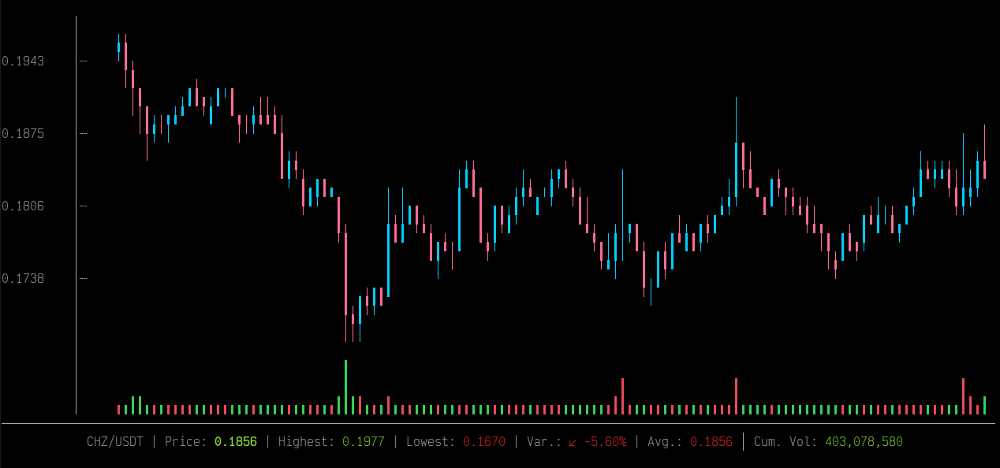

# Python Candlesticks Chart

📈 Draw candlesticks charts right into your terminal, using Python!



This is a portage from the great [cli-candlestick-chart](https://github.com/Julien-R44/cli-candlestick-chart) (developed by [Julien-R44](https://github.com/Julien-R44), written in Rust).
You are looking at the Python 3.10+ version.

Note: not tested on macOS, nor Windows (it will likely fail to render colors).

**Table of contents**:
- [Python Candlesticks Chart](#python-candlesticks-chart)
  - [Features](#features)
  - [Intallation](#intallation)
  - [Demonstration](#demonstration)
- [Binary Usage](#binary-usage)
- [Examples](#examples)
  - [API](#api)
  - [Binary](#binary)
    - [Read CSV from file](#read-csv-from-file)
    - [Read JSON from file](#read-json-from-file)
    - [Read from stdin](#read-from-stdin)

## Features

- Auto-fit to terminal size
- Practical formatting for big, and tiny, numbers
- Integration with [Rich](https://github.com/Textualize/rich)
- Simple, yet customizable, API
- Exact same API as the [Rust version](https://github.com/Julien-R44/cli-candlestick-chart), plus some [sugar](#demonstration)
- Simple installation, no external dependencies

## Intallation

As simple as:

```bash
$ python -m pip install -U candlestick-chart
```

## Demonstration

```python
from candlestick_chart import Candle, Chart

# Add some candles
candles = [
    Candle(133.520004, 133.610001, 126.760002, 129.410004),
    Candle(128.889999, 131.740005, 128.429993, 131.009995),
    Candle(127.720001, 131.050003, 126.379997, 126.599998),
    Candle(128.360001, 131.630005, 127.860001, 130.919998),
    Candle(132.429993, 132.630005, 130.229996, 132.050003),
]

# Create and display the chart
# Optional keyword arguments: title, width, height
chart = Chart(candles, title="Optional title")

# Set the chart title
chart.set_name("BTC/USDT")

# Set customs colors
chart.set_bear_color(1, 205, 254)
chart.set_bull_color(255, 107, 153)
chart.set_vol_bull_color(1, 205, 254)
chart.set_vol_bear_color(255, 107, 153)

# Set custom labels (empty string => label not displayed)
chart.set_label("highest", "ATH")
chart.set_label("lowest", "ATL")
chart.set_label("average", "")
chart.set_label("volume", "")

# Volume pane settings
chart.set_volume_pane_height(6)
chart.set_volume_pane_enabled(False)

# And, it is also responsive!
new_width = 200
new_height = 150
chart.update_size(new_width, new_height)

# By the way, did you know that you can add more candles in real-time?
chart.update_candles(candles[:3])
# Or completely replace current candles
chart.update_candles(candles[:3], reset=True)

chart.draw()
```

# Binary Usage

When installing the library, an executable is made available (`candlestick-chart`):

```bash
$ candlestick-chart --help             

options:
  -h, --help            show this help message and exit
  -m {stdin,csv-file,json-file}, --mode {stdin,csv-file,json-file}
                        Select the method for retrieving the candles.
  -f FILE, --file FILE  [MODE:*-file] File to read candles from.
  --chart-name CHART_NAME
                        Sets the chart name.
  --bear-color BEAR_COLOR
                        Sets the descending candles color in hexadecimal.
  --bull-color BULL_COLOR
                        Sets the ascending candles color in hexadecimal.
  --version             show program's version number and exit
```

When requesting the JSON or stdin mode, the library expects a JSON with the following format: 

```json
[
    {
        "open": 28994.009766,
        "high": 29600.626953,
        "low": 28803.585938,
        "close": 29374.152344
    },
    ...
]
```

For all requests, here are supported fields:

```python
"open": float  # mandatory
"close": float  # mandatory
"high": float  # mandatory
"low": float  # mandatory
"volume": float
"timestamp": float
```

# Examples

## API 

- [Basic example with CSV parsing](examples/basic-from-csv-file.py): run with `$ python examples/basic-from-csv-file.py`
- [Basic example with JSON parsing](examples/basic-from-json-file.py): run with `$ python examples/basic-from-json-file.py`
- [Basic example with stdin parsing](examples/basic-from-stdin.sh): run with `$ ./examples/basic-from-stdin.sh`
- [Fetch candles from Binance](examples/fetch-from-binance.py): run with `$ python examples/fetch-from-binance.py`
- [Integration with Rich](examples/integrate-with-rich.py): run with `$ python examples/integrate-with-rich.py`

## Binary 

### Read CSV from file

```bash
$ candlestick-chart \
    --mode=csv-file \
    --file='./examples/BTC-USD.csv' \
    --chart-name='My BTC Chart' \
    --bear-color='#b967ff' \
    --bull-color='ff6b99'
```
### Read JSON from file

```bash
$ candlestick-chart \
    --mode=json-file \
    --file='./examples/BTC-chart.json' \
    --chart-name='My BTC Chart' \
    --bear-color='#b967ff' \
    --bull-color='ff6b99'
```

### Read from stdin

```bash
echo '[
  {
    "open": 28994.009766,
    "high": 29600.626953,
    "low": 28803.585938,
    "close": 29374.152344
  },
  {
    "open": 29376.455078,
    "high": 33155.117188,
    "low": 29091.181641,
    "close": 32127.267578
  }
]' | candlestick-chart \
    --mode=stdin \
    --chart-name='My BTC Chart' \
    --bear-color='#b967ff' \
    --bull-color='ff6b99'
```
